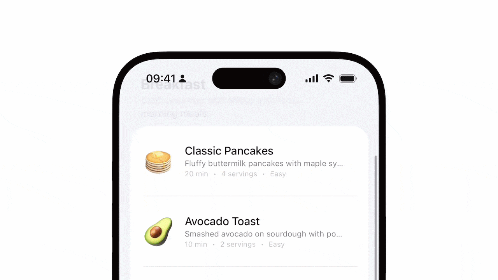

<div align="center">
  
  <h1><b>Afloat</b></h1>
  <p>
    Contextual navigation titles that animate based on scroll position for SwiftUI.
  </p>
</div>

<p align="center">
  <a href="https://swift.org"></a>
  <a href="https://developer.apple.com"></a>
  <a href="https://developer.apple.com"></a>
  <a href="https://developer.apple.com"></a>
</p>

<div align="center">
  
</div>


## Overview

Afloat provides dynamic navigation titles and subtitles that respond to scroll events in SwiftUI. Perfect for list-based interfaces where you want the navigation bar to display context about what the user is viewing.

- **Contextual Navigation** — Titles and subtitles that change as users scroll
- **Native Look & Feel** — Animations match iOS's default behavior
- **Cross-Platform** — iOS, macOS, and visionOS
- **SwiftUI Native** — Drop-in replacements for standard modifiers
- **Lightweight** — No dependencies, small footprint

## Installation

```swift
dependencies: [
    .package(url: "https://github.com/AdelaideSky/Afloat.git", from: "1.0.0")
]
```


## Usage

```swift
import Afloat

NavigationStack {
    ScrollView {
        ForEach(sections) { section in
            SectionHeader(section)
                .navigationTitle(.contextual, section.name)
                .navigationSubtitle(.contextual, "\(section.items.count) items")
        }
    }
    .contextualNavigation(defaultTitle: "All Sections")
}
```

See [RecipeBookExample.swift](Sources/Afloat/Examples/RecipeBookExample.swift) for a complete example.


## How It Works

Afloat uses SwiftUI's `PreferenceKey` system to track the position of views marked with contextual navigation modifiers. When a view scrolls past the top edge of the screen, its title and subtitle are collected and displayed in the navigation bar. The `ContextualNavigationManager` monitors these preference updates and determines which title should be active based on scroll position, creating smooth transitions between sections.


## Documentation

Full API reference and guides are available in the DocC documentation.


## Roadmap

- [ ] Add support for Large navigation title
- [ ] More animation options (.numericText etc)
- [ ] Toolbars support


## License

MIT. See [LICENSE](LICENSE) for details.


## Contact

- [Website](https://adesky.fr/)
- [Twitter](https://x.com/ade_sky_/)
- [LinkedIn](https://www.linkedin.com/in/adelaidehumez/)
